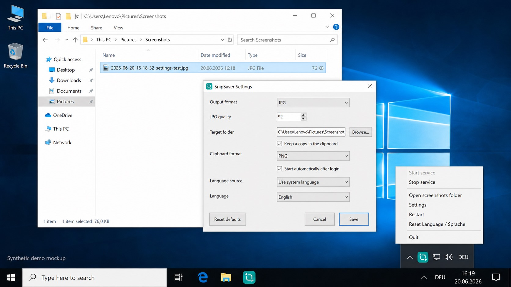

# SnipSaverWin10

SnipSaverWin10 is a small Windows 10 tray helper that saves screenshots from the Windows 10 snipping workflow into the user's Screenshots folder.

It is intentionally scoped to Windows 10. Windows 11 already has different built-in Snipping Tool autosave behavior, so this project is not trying to replace or patch Windows 11.



> The image above is a synthetic demo mockup for the README, not a forensic screenshot.

## What it does

- Runs as a per-user tray app.
- Saves snips as `JPG` or `PNG`.
- Defaults to `JPG` output with quality `92`.
- Uses `C:\Users\<User>\Pictures\Screenshots` by default.
- Can keep a copy in the clipboard.
- Can start automatically after login when enabled.
- Provides a tray menu and a small settings dialog.

## Windows 10 Scope

This app is built specifically for Windows 10 systems where the Snipping Tool / Screen Sketch workflow does not autosave screenshots the same way Windows 11 does.

Supported UI languages are currently:

- Deutsch
- English

Other language files were intentionally removed from the active build until the WinForms encoding path is made reliable.

## Install

Recommended release artifacts:

- `SnipSaverWin10-Installer.exe` installs the per-user tray app and can enable login autostart.
- `SnipSaverWin10-Portable.exe` extracts a portable copy next to the EXE and starts it without permanent installation.

Manual script install for development:

```powershell
powershell.exe -NoProfile -ExecutionPolicy Bypass -File .\outputs\Install-SnipSaver.ps1
```

Then start:

```cmd
outputs\Run-SnipSaver-Tray.cmd
```

Install without autostart:

```powershell
powershell.exe -NoProfile -ExecutionPolicy Bypass -File .\outputs\Install-SnipSaver.ps1 -NoAutostart
```

## Settings

The settings dialog currently supports:

- Output format: `JPG` or `PNG`
- JPG quality
- Target folder
- Clipboard retention
- Clipboard format: `PNG` or `JPG`
- Start automatically after login
- Language: system, Deutsch, English

Windows 10 may repeat saves when `PNG` is kept in the clipboard on some systems. If that happens, switch clipboard format to `JPG` or disable clipboard retention.

## Test

Run the repeatable settings smoke test:

```powershell
# Stop SnipSaver first, then run:
powershell.exe -NoProfile -STA -ExecutionPolicy Bypass -File .\outputs\Test-SnipSaverSettings.ps1
```

Current local result:

```text
23/23 checks passed
```

The test covers defaults, invalid setting normalization, language fallback, JPG/PNG saving, clipboard byte generation, icon loading, and autostart toggling.

## Current Version

Current prepared version: `v0.5.8`.

See [outputs/releases/v0.5.8.md](outputs/releases/v0.5.8.md).

## Build Release Artifacts

```powershell
powershell.exe -NoProfile -ExecutionPolicy Bypass -File .\tools\Build-ReleaseArtifacts.ps1
```

This creates:

- `dist\SnipSaverWin10-Installer.exe`
- `dist\SnipSaverWin10-Portable.exe`
- `dist\SnipSaverWin10-payload.zip`
